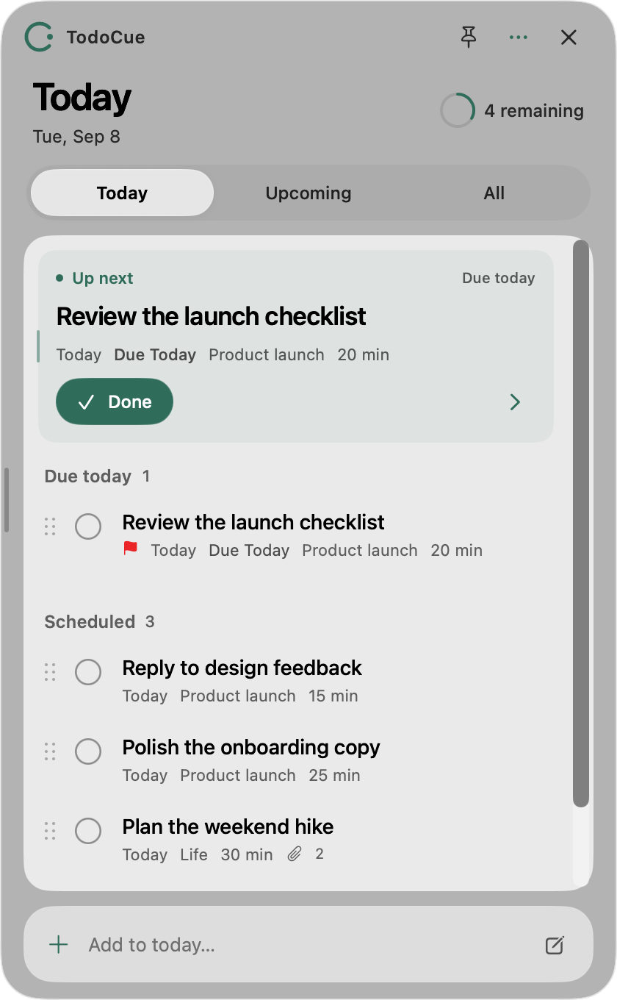
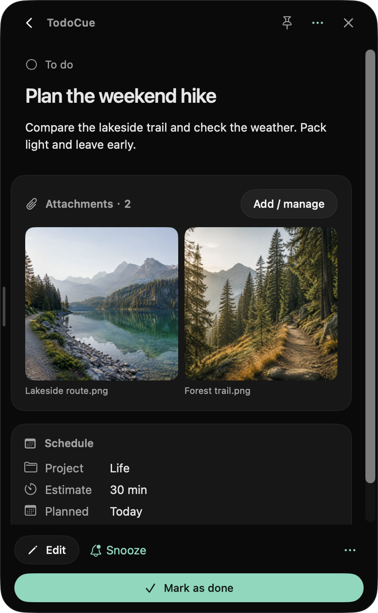
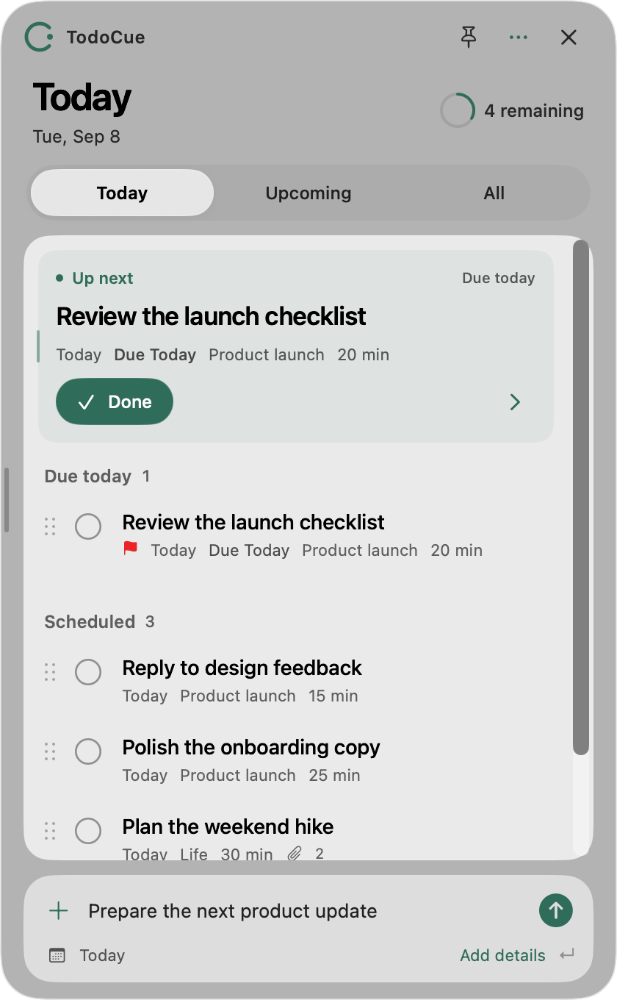
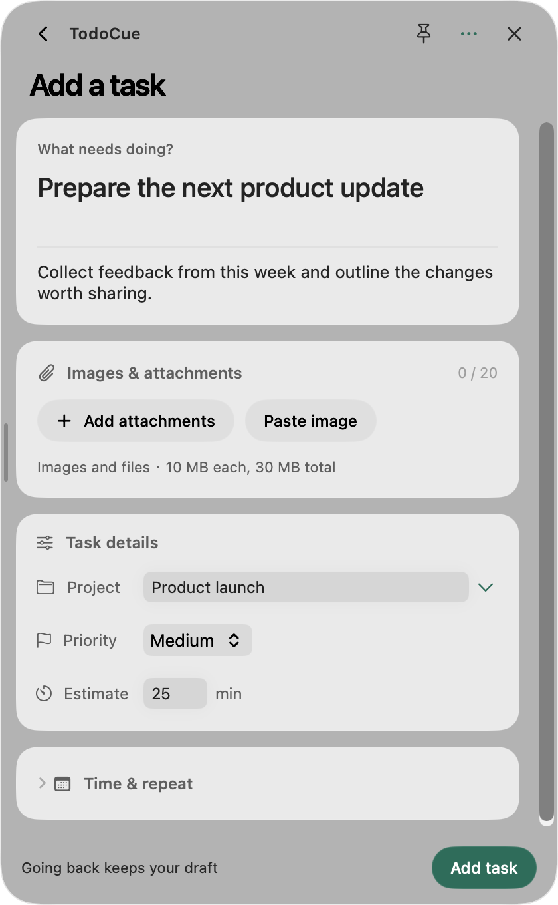

**English** · [简体中文](README.zh-CN.md)

<p align="center">
  
</p>

<p align="center">
  <strong>Turn your Agent conversations into things that get done.</strong><br>
  Create and manage tasks and reminders with natural language, through Skills.<br>
  TodoCue keeps them visible on your Mac and reminds you when it's time.
</p>

<p align="center">
  <a href="https://github.com/NanmiCoder/TodoCue/releases/latest"><strong>Download for macOS</strong></a> ·
  <a href="#install-the-skill">Install the Skill</a> ·
  <a href="release-notes/">Release notes</a> ·
  <a href="LICENSE">MIT</a>
</p>

## Plan in the conversation. See it on your Mac.

While you code, discuss ideas, or work across projects with an Agent, little follow-ups come up: check a release tomorrow, send a draft, revisit a decision. Ask your Agent to save them in TodoCue and keep the conversation going. The tasks appear in the native macOS panel; set a reminder and TodoCue will notify you when it's time.

**Your Agent is the main way to use TodoCue.** The same Skill lets Claude Code, Codex, Cursor, WorkBuddy, and other Agents that support Skills and local commands create, find, update, and complete tasks. Across projects and Agents, they work with the same task list on your Mac.

| Say something like… | What happens |
| --- | --- |
| “Use TodoCue to remind me tomorrow at 9 AM to check this project's release.” | A task is saved with a reminder at the specified time. |
| “Add the three action items we just agreed on to TodoCue under Website redesign.” | Each action item becomes a task in that project. |
| “What's left in TodoCue today?” | Your Agent checks today's tasks and the next suggestion. |
| “Move the release check to 3 PM the day after tomorrow, and move its reminder too.” | Both the plan and reminder are updated. |
| “Mark the release check in TodoCue as done.” | Your Agent finds the task and completes it. |

Your Agent interprets the language. TodoCue stores the tasks and runs the reminders. You can also open the app to fill in a form or drag tasks into the order you want.

**Get started: [download and open the app](#download--install) → [install the Skill](#install-the-skill) → tell your Agent what needs doing.**

## A clear view of today

Tasks created by your Agent appear in the panel. Start with the next suggestion, then see the rest of today's plans. Open a task to see its notes, project, estimate, and deadline together.

<p align="center">
  
  
</p>

These are fresh English app screenshots at 2× resolution, captured with fictional tasks in a separate demo database. The hiking photos are generated demo attachments. **The app supports English and Simplified Chinese**—switch in Settings and your choice takes effect immediately. Resize the panel from 300 to 600 points; TodoCue remembers its width. The menu bar and notch quick look keep your tasks close by.

## Prefer a form? It's still here.

Away from an Agent conversation, type a task title at the bottom of the panel and press Return to add it to today. Choose **Add details** to fill in a project, priority, time, reminder, or repeat rule. Your existing text stays in place.

<p align="center">
  
  
</p>

- **Look further ahead.** Open the calendar from the panel header (⌘⇧K) to see what you have done, what is in flight, and what is scheduled months out. Switch between a month grid and a week list; pick a day to work through it. Drag a task onto another day to reschedule it — the time of day is kept, the deadline and reminder are not touched — and add straight to the day you are looking at. Repeating tasks beyond the 30-day generation horizon show as not-yet-created placeholders rather than an empty month.
- **Reorder as you go.** Drag a task and its neighbors move out of the way. Move between projects in All or dates in Upcoming; reorder within a group in Today. Undo a move or restore automatic sorting.
- **Choose your language.** English and Simplified Chinese are available in Settings. The first launch follows your system language, with English as the fallback. Task content stays in its original language.
- **Keep it close.** A native SwiftUI and AppKit floating panel with light and dark appearances. macOS 26 uses Liquid Glass; earlier systems use compatible materials.
- **A glance at the notch.** On MacBooks with a notch, see the remaining count beside it. Hover to expand today's tasks, then complete, snooze, reschedule, or add a task. Click to pin and type; Esc collapses it.
- **Reminders that follow through.** Repeat tasks, set reminders, snooze, and undo completion. Closing the panel leaves the background reminder service running.
- **Your data stays yours.** Tasks live in `~/.todocue/todocue.sqlite`. Replacing, removing, or reinstalling the app keeps that directory intact.

## Download & install

Current version: **[v0.1.2](https://github.com/NanmiCoder/TodoCue/releases/tag/v0.1.2)**. Requires **macOS 14 or later**. Both architectures are distributed as Developer ID–signed, Apple-notarized apps and DMGs.

| Your Mac | Installer |
| --- | --- |
| Apple Silicon (M series) | [Download ARM64 DMG](https://github.com/NanmiCoder/TodoCue/releases/download/v0.1.2/TodoCue-0.1.2-macOS-arm64.dmg) |
| Intel | [Download Intel DMG](https://github.com/NanmiCoder/TodoCue/releases/download/v0.1.2/TodoCue-0.1.2-macOS-x64.dmg) |

Open the DMG → drag **TodoCue.app into Applications** → launch it from Applications.

The app bundles Node, the background service, CLI, notification helper, and Agent Skill. No separate runtime installation is needed. Allow notifications in Settings when you want reminders. To update, quit the old app, replace it with the new one, and reopen it. In-app automatic updates are not yet available.

[Checksums](https://github.com/NanmiCoder/TodoCue/releases/download/v0.1.2/SHA256SUMS) · [Installation, backup, and removal (中文)](docs/macos-install.md)

## Install the Skill

Install and open TodoCue once, then use the [Skills CLI](https://github.com/vercel-labs/skills) to install the Skill for your local Agent. This command requires Node.js / npx. Follow the prompts to select Claude Code, Codex, Cursor, or another supported client:

```bash
npx skills add NanmiCoder/TodoCue --skill todocue -g
```

For WorkBuddy or clients not listed by the installer, import the repository's [`skills/todocue`](skills/todocue) directory using the client's custom Skills setup. See [WorkBuddy's custom Skills guide](https://www.workbuddy.ai/docs/workbuddy/From-Beginner-to-Expert-Guide/Practice-Cases/Create-Skills) and the [Skills CLI supported agents](https://github.com/vercel-labs/skills#supported-agents).

Then ask: “Use TodoCue to add a task to summarize this week's progress, plan it for today, put it under Work, and estimate 25 minutes.” Keep using natural language to query, reschedule, set reminders, and complete tasks.

The Agent must have access to the same Mac where TodoCue is installed and permission to run local commands. Loading the Skill in a remote or cloud-only environment does not give it access to this Mac's tasks. The app's quick-add field saves a task title; dates and reminders can be set in the form.

MCP is an optional entry point via `todocue mcp`. For custom integrations, see the [Local API documentation](docs/api.md).

<details>
<summary><strong>Build from source & contribute</strong></summary>

Requires macOS 14+, Node 24+, and an Xcode 26 / Swift 6 toolchain.

```bash
npm ci
npm run build
npm test
swift test --package-path apps/macos
npm run macos:dmg
```

The DMG is written to `apps/macos/build/`. Local packaging downloads and verifies a pinned official Node runtime, installs locked production dependencies, and checks that the bundled Node, SQLite, and MCP run correctly.

| Path | Responsibility |
| --- | --- |
| `apps/macos` | SwiftUI / AppKit client and notification helper |
| `packages/engine` | Task rules, recurring occurrences, reminders, and SQLite |
| `packages/server` | Local API, authentication, and SSE updates |
| `packages/cli`, `packages/shared` | CLI / MCP interfaces and shared contracts |
| `skills/todocue` | Distributable Agent Skill |

Use `npm run dev:serve` for development and `TODOCUE_HOME` to isolate development data. Pushing a `vX.Y.Z` tag triggers GitHub Actions to build, sign, notarize, and release both architectures.

[Release guide (中文)](docs/github-release.md) · [Implementation and QA (中文)](docs/implementation-plan.md) · [Open an issue](https://github.com/NanmiCoder/TodoCue/issues)

</details>

## License

[MIT](LICENSE) © 2026 NanmiCoder. Contributions welcome.
