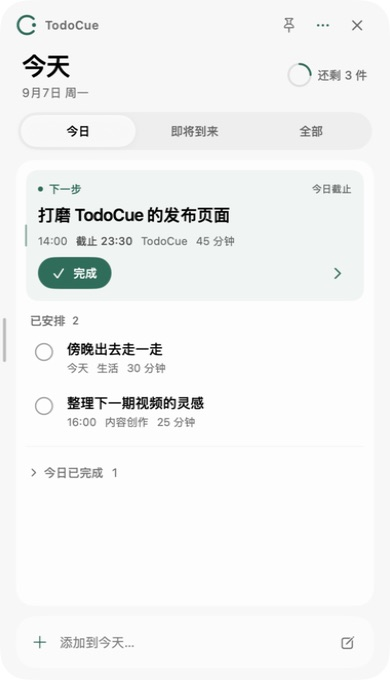
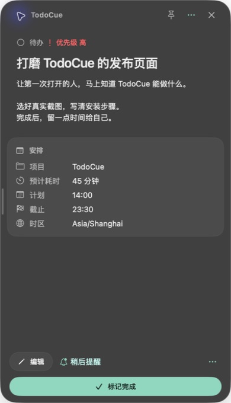
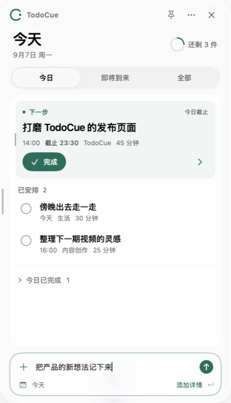
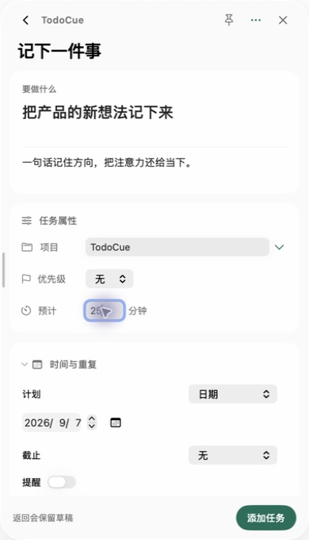

<p align="center">
  
</p>

<p align="center">
  <strong>把事情记在手边，把注意力留给当下。</strong><br>
  一个原生 macOS 待办工具。你用浮动面板，Agent 用 CLI 或 MCP，操作同一份本地任务。
</p>

<p align="center">
  <a href="https://github.com/NanmiCoder/TodoCue/releases/latest"><strong>下载 macOS 版</strong></a> ·
  <a href="docs/agents.md">Agent 接入</a> ·
  <a href="release-notes/">版本说明</a> ·
  <a href="LICENSE">MIT</a>
</p>

## 看清今天，只管下一步

打开面板，先看到今天最该处理的一件事，再看其余安排。点开任务，备注、项目、预计耗时和截止时间都在同一处。

<p align="center">
  
  
</p>

**浅色的今天，深色的详情。** 上图均为真实 macOS App 截图，使用演示任务。窗口可在 300–600 点之间调整宽度并记住选择；菜单栏和刘海快览提供随手查看的入口。

## 想到，就记下来

在底部输入一句话，回车就加入今天。需要更完整的安排时，点「添加详情」继续填写项目、优先级、时间、提醒或重复规则，已经输入的内容会保留。

<p align="center">
  
  
</p>

- **待在手边。** 原生 SwiftUI + AppKit 浮动面板，支持浅色与深色外观。macOS 26 使用 Liquid Glass，旧系统采用兼容材质。
- **安排有后续。** 支持重复任务、提醒、稍后提醒，以及完成后的撤销。关闭面板后，后台服务继续负责提醒。
- **数据属于你。** 任务保存在 `~/.todocue/todocue.sqlite`。覆盖、删除或重新安装 App 后，这个目录仍然保留。

## 下载与安装

当前版本 **[v0.1.0](https://github.com/NanmiCoder/TodoCue/releases/tag/v0.1.0)**，最低要求 **macOS 14**。两个架构的 App 和 DMG 均通过 Developer ID 签名与 Apple 公证。

| 你的 Mac | 安装包 |
| --- | --- |
| Apple Silicon（M 系列） | [下载 ARM64 DMG](https://github.com/NanmiCoder/TodoCue/releases/download/v0.1.0/TodoCue-0.1.0-macOS-arm64.dmg) |
| Intel | [下载 Intel DMG](https://github.com/NanmiCoder/TodoCue/releases/download/v0.1.0/TodoCue-0.1.0-macOS-x64.dmg) |

打开 DMG → 将 **TodoCue.app 拖入 Applications** → 从应用程序中启动。

App 自带 Node、后台服务、CLI、通知辅助程序和 Agent skill，无需另装运行时。需要提醒时，在设置中允许通知。更新时下载新 DMG 并替换 App；当前尚无 App 内自动更新。

[校验和](https://github.com/NanmiCoder/TodoCue/releases/download/v0.1.0/SHA256SUMS) · [安装、备份与卸载](docs/macos-install.md)

## 让 Agent 和你操作同一份待办

把 [TodoCue skill](skills/todocue/SKILL.md) 安装给 Codex、Claude Code 或其他支持 skills 的本机 Agent，就可以这样描述：

> 帮我把「整理本周进展」放到今天，归到工作项目，预计 25 分钟。

Agent 通过 CLI 操作本地服务，结果会同步显示在 App 中。也可以直接在终端使用：

```bash
todocue add "整理本周进展" -d today -p work -e 25
todocue today
todocue --json today
```

偏好 MCP 的 Agent 可连接 `todocue mcp`。CLI、MCP 和桌面端共用同一套任务规则、同一份 SQLite 数据；Local API 只监听 `127.0.0.1`，使用本机令牌认证。

[安装 skill 与 MCP 接入步骤](docs/agents.md) · [Local API 文档](docs/api.md)

<details>
<summary><strong>从源码构建与参与开发</strong></summary>

需要 macOS 14+、Node 24+、Xcode 26 / Swift 6 工具链。

```bash
npm ci
npm run build
npm test
swift test --package-path apps/macos
npm run macos:dmg
```

DMG 位于 `apps/macos/build/`。本地打包会下载并校验固定版本的官方 Node，安装锁定的生产依赖，并检查内置 Node、SQLite 和 MCP 能否运行。

| 路径 | 职责 |
| --- | --- |
| `apps/macos` | SwiftUI / AppKit 客户端与通知辅助程序 |
| `packages/engine` | 任务规则、重复实例、提醒与 SQLite |
| `packages/server` | Local API、认证与 SSE 实时同步 |
| `packages/cli`、`packages/shared` | CLI / MCP 接口与共享契约 |
| `skills/todocue` | 可分发的 Agent skill |

开发时运行 `npm run dev:serve`；使用 `TODOCUE_HOME` 可隔离开发数据。GitHub Actions 在推送 `vX.Y.Z` 标签后构建双架构安装包，完成签名、公证后发布 Release。

[发布指南](docs/github-release.md) · [实现与验收](docs/implementation-plan.md) · [提交 Issue](https://github.com/NanmiCoder/TodoCue/issues)

</details>

## 许可证

[MIT](LICENSE) © 2026 NanmiCoder。欢迎使用、修改和贡献。
