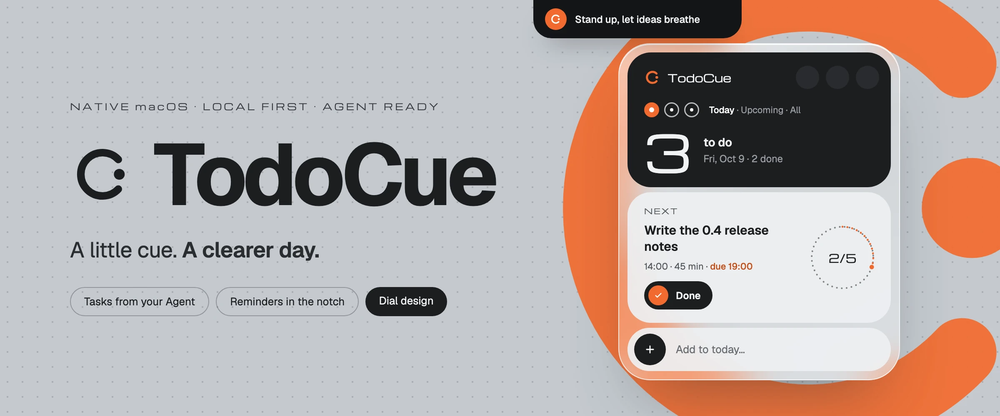
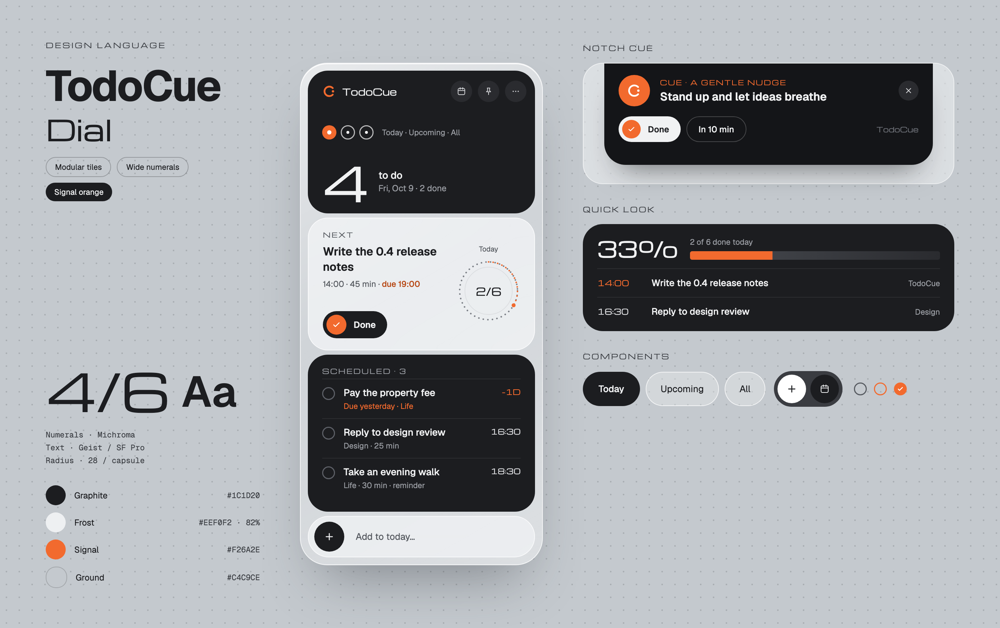

**English** · [简体中文](README.zh-CN.md)

<p align="center">
  
</p>

<p align="center">
  <strong>Turn your Agent conversations into things that get done.</strong><br>
  Create and manage tasks and reminders with natural language, through Skills.<br>
  TodoCue keeps them visible on your Mac and reminds you when it's time.
</p>

<p align="center">
  <a href="https://github.com/NanmiCoder/TodoCue/releases/latest"><strong>Download for macOS</strong></a> ·
  <a href="#install-the-skill">Install the Skill</a> ·
  <a href="release-notes/">Release notes</a> ·
  <a href="LICENSE">MIT</a>
</p>

## Plan in the conversation. See it on your Mac.

While you code, discuss ideas, or work across projects with an Agent, little follow-ups come up: check a release tomorrow, send a draft, revisit a decision. Ask your Agent to save them in TodoCue and keep the conversation going. The tasks appear in the native macOS panel; set a reminder and TodoCue will notify you when it's time.

**Your Agent is the main way to use TodoCue.** The same Skill lets Claude Code, Codex, Cursor, WorkBuddy, and other Agents that support Skills and local commands create, find, update, and complete tasks. Across projects and Agents, they work with the same task list on your Mac.

| Say something like… | What happens |
| --- | --- |
| “Use TodoCue to remind me tomorrow at 9 AM to check this project's release.” | A task is saved with a reminder at the specified time. |
| “Add the three action items we just agreed on to TodoCue under Website redesign.” | Each action item becomes a task in that project. |
| “What's left in TodoCue today?” | Your Agent checks today's tasks and the next suggestion. |
| “Move the release check to 3 PM the day after tomorrow, and move its reminder too.” | Both the plan and reminder are updated. |
| “Mark the release check in TodoCue as done.” | Your Agent finds the task and completes it. |

Your Agent interprets the language. TodoCue stores the tasks and runs the reminders. You can also open the app to fill in a form or drag tasks into the order you want.

**Get started: [download and open the app](#download--install) → [install the Skill](#install-the-skill) → tell your Agent what needs doing.**

## A clear view of today

Tasks created by your Agent appear in the panel. Start with the next suggestion, then see the rest of today's plans. Open a task to see its notes, project, estimate, and deadline together.

<p align="center">
  
</p>

**Dial** is TodoCue's design language: graphite tiles for what you read at a glance, frosted tiles for what you act on, wide numerals, and a single signal orange. The tiles sit together in one tray — Liquid Glass on macOS 26 — so the panel reads as a single object on any wallpaper. Finishing a task draws its checkmark and advances the dotted gauge; reminders drop from the notch with a soft ripple. **The app supports English and Simplified Chinese**—switch in Settings and your choice takes effect immediately. Resize the panel from 300 to 600 points; TodoCue remembers its width.

## Prefer a form? It's still here.

Away from an Agent conversation, type a task title at the bottom of the panel and press Return to add it to today. Choose **Add details** to fill in a project, priority, time, reminder, or repeat rule. Your existing text stays in place.

Drag the empty area in the top bar to move the panel; dragging in titles and notes selects text. Back keeps drafts, with new tasks and each task’s edits stored separately. If a task changes elsewhere, the editor keeps your input and offers an explicit reload of the latest task.

- **See what you finished.** Completed work is kept: open Completed from the panel menu, or from the day's completed list, to review by day and search back through it. Reopen anything with one click.
- **Look further ahead.** Open the calendar from the panel header (⌘⇧K) to see what you have done, what is in flight, and what is scheduled months out. Switch between a month grid and a week list; pick a day to work through it. Drag a task onto another day to reschedule it — the time of day is kept, the deadline and reminder are not touched — and add straight to the day you are looking at. Repeating tasks beyond the 30-day generation horizon show as not-yet-created placeholders rather than an empty month.
- **Carry it to your iPhone.** Turn on **Sync to Calendar** or **Sync to Reminders** in Settings and dated tasks appear in a "TodoCue" calendar or reminder list that iCloud brings to your iPhone. Changes go both ways: reschedule, rename, or check off there and TodoCue follows; deleting an item cancels its task. Reminders alone is the recommended setup — dated reminders also appear in Calendar on iOS 18 and macOS 15. Sync runs while the app is open and adds no alerts of its own. [Details (中文)](docs/apple-sync.md)
- **Reorder as you go.** Drag a task and its neighbors move out of the way. Move between projects in All or dates in Upcoming; reorder within a group in Today. Undo a move or restore automatic sorting.
- **Choose your language.** English and Simplified Chinese are available in Settings. The first launch follows your system language, with English as the fallback. Task content stays in its original language.
- **Keep it close.** A native SwiftUI and AppKit floating panel in light and dark appearances. Graphite tiles stay dark; frosted tiles follow your system and blur the desktop behind them.
- **A glance at the notch.** On MacBooks with a notch, see the remaining count beside it. Hover to expand today's tasks, then complete, snooze, reschedule, or add a task. Click to pin and type; Esc collapses it. With the lid closed or on external displays, TodoCue draws a notch in the middle of the menu bar that follows the pointer to whichever screen you are using; turn it off in Settings.
- **Reminders that follow through.** Repeat tasks, set reminders, snooze, and undo completion. Closing the panel leaves the background reminder service running.
- **Your data stays yours.** Tasks live in `~/.todocue/todocue.sqlite`. Replacing, removing, or reinstalling the app keeps that directory intact.

## Download & install

Current version: **[v0.4.2](https://github.com/NanmiCoder/TodoCue/releases/tag/v0.4.2)**. Requires **macOS 14 or later**. Both architectures are distributed as Developer ID–signed, Apple-notarized apps and DMGs.

| Your Mac | Installer |
| --- | --- |
| Apple Silicon (M series) | [Download ARM64 DMG](https://github.com/NanmiCoder/TodoCue/releases/download/v0.4.2/TodoCue-0.4.2-macOS-arm64.dmg) |
| Intel | [Download Intel DMG](https://github.com/NanmiCoder/TodoCue/releases/download/v0.4.2/TodoCue-0.4.2-macOS-x64.dmg) |

Open the DMG → drag **TodoCue.app into Applications** → launch it from Applications.

The app bundles Node, the background service, CLI, notification helper, and Agent Skill. No separate runtime installation is needed. Allow notifications in Settings when you want reminders — macOS asks only once, so if you declined before, enable TodoCueNotifier under System Settings › Notifications (the app's 打开系统设置 button takes you there). To update, quit the old app, replace it with the new one, and reopen it. In-app automatic updates are not yet available.

[Checksums](https://github.com/NanmiCoder/TodoCue/releases/download/v0.4.2/SHA256SUMS) · [Installation, backup, and removal (中文)](docs/macos-install.md)

## Install the Skill

Install and open TodoCue once, then use the [Skills CLI](https://github.com/vercel-labs/skills) to install the Skill for your local Agent. This command requires Node.js / npx. Follow the prompts to select Claude Code, Codex, Cursor, or another supported client:

```bash
npx skills add NanmiCoder/TodoCue --skill todocue -g
```

For WorkBuddy or clients not listed by the installer, import the repository's [`skills/todocue`](skills/todocue) directory using the client's custom Skills setup. See [WorkBuddy's custom Skills guide](https://www.workbuddy.ai/docs/workbuddy/From-Beginner-to-Expert-Guide/Practice-Cases/Create-Skills) and the [Skills CLI supported agents](https://github.com/vercel-labs/skills#supported-agents).

Then ask: “Use TodoCue to add a task to summarize this week's progress, plan it for today, put it under Work, and estimate 25 minutes.” Keep using natural language to query, reschedule, set reminders, and complete tasks.

The Agent must have access to the same Mac where TodoCue is installed and permission to run local commands. Loading the Skill in a remote or cloud-only environment does not give it access to this Mac's tasks. The app's quick-add field saves a task title; dates and reminders can be set in the form.

MCP is an optional entry point via `todocue mcp`. For custom integrations, see the [Local API documentation](docs/api.md).

<details>
<summary><strong>Build from source & contribute</strong></summary>

Requires macOS 14+, Node 24+, and an Xcode 26 / Swift 6 toolchain.

```bash
npm ci
npm run build
npm test
swift test --package-path apps/macos
npm run macos:dmg
```

The DMG is written to `apps/macos/build/`. Local packaging downloads and verifies a pinned official Node runtime, installs locked production dependencies, and checks that the bundled Node, SQLite, and MCP run correctly.

| Path | Responsibility |
| --- | --- |
| `apps/macos` | SwiftUI / AppKit client and notification helper |
| `packages/engine` | Task rules, recurring occurrences, reminders, and SQLite |
| `packages/server` | Local API, authentication, and SSE updates |
| `packages/cli`, `packages/shared` | CLI / MCP interfaces and shared contracts |
| `skills/todocue` | Distributable Agent Skill |

Use `npm run dev:serve` for development and `TODOCUE_HOME` to isolate development data. Pushing a `vX.Y.Z` tag triggers GitHub Actions to build, sign, notarize, and release both architectures.

[Release guide (中文)](docs/github-release.md) · [Implementation and QA (中文)](docs/implementation-plan.md) · [Open an issue](https://github.com/NanmiCoder/TodoCue/issues)

</details>

## License

[MIT](LICENSE) © 2026 NanmiCoder. Contributions welcome.
