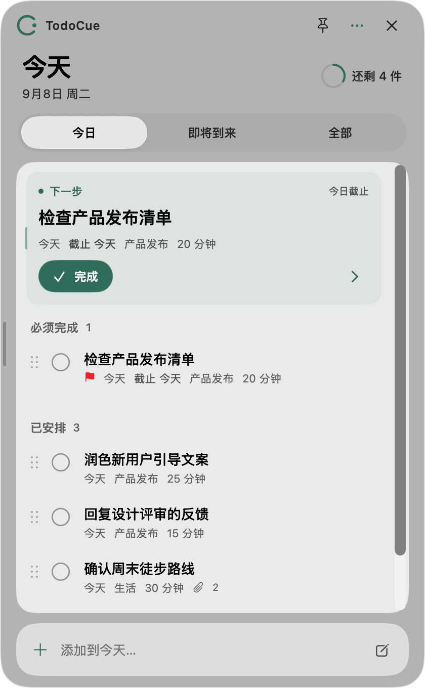
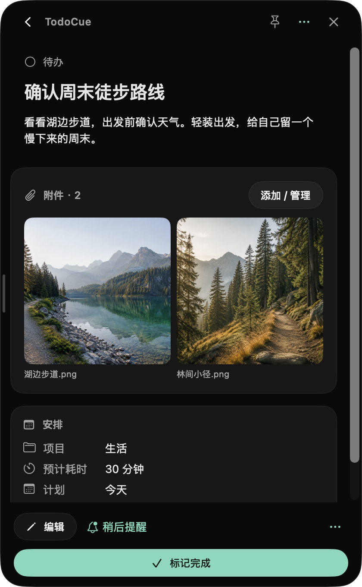
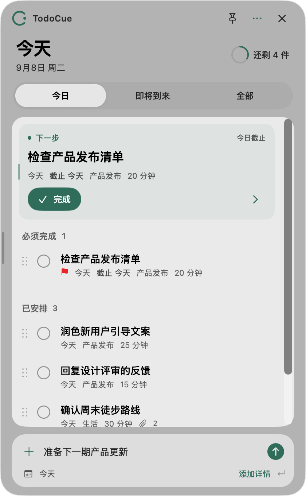
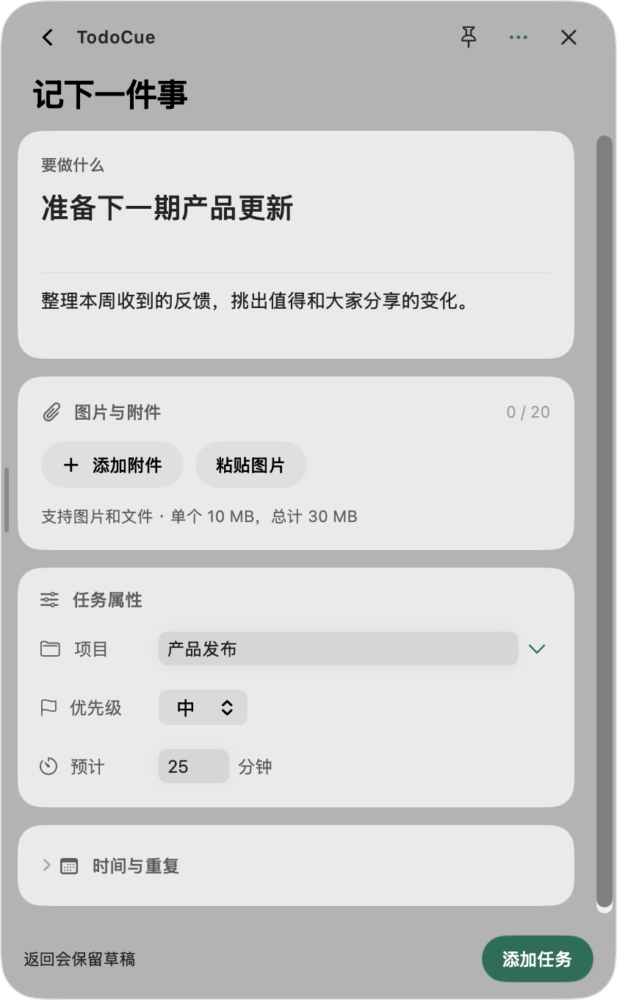

[English](README.md) · **简体中文**

<p align="center">
  
</p>

<p align="center">
  <strong>和 Agent 聊到的事，一句话变成待办。</strong><br>
  通过 Skills，让 Agent 用自然语言创建、管理任务与提醒。<br>
  TodoCue 把它们放在 Mac 手边，随时可见，到时提醒。
</p>

<p align="center">
  <a href="https://github.com/NanmiCoder/TodoCue/releases/latest"><strong>下载 macOS 版</strong></a> ·
  <a href="#安装-skills">安装 Skills</a> ·
  <a href="release-notes/">版本说明</a> ·
  <a href="LICENSE">MIT</a>
</p>

## 在对话里安排，在 Mac 上看见

和 Agent 写代码、讨论方案、推进不同项目时，总会聊到一些「待会儿做」「明天跟进」的事。直接让 Agent 记进 TodoCue，继续手头的对话。任务创建后，就能在原生 macOS 面板里看到；设置了提醒，到时间也会通知你。

**Agent 是 TodoCue 的主要交互入口。** 通过同一份 Skill，在 Claude Code、Codex、Cursor、WorkBuddy 等支持 Skills 且能执行本机命令的 Agent 中，用自然语言完成任务的创建、查询、修改与完成。不同项目、不同 Agent，管理的是这台 Mac 上同一份待办。

| 你可以这样说 | TodoCue 帮你记好 |
| --- | --- |
| 「用 TodoCue 明天上午九点提醒我检查这个项目的发布结果。」 | 创建任务，设置明确的提醒时间 |
| 「把刚才确定的三件事加入 TodoCue，归到网站改版项目。」 | 把对话中的行动项分别保存，按项目归类 |
| 「看看 TodoCue 今天还有什么没做。」 | 查询今天的待办和下一步建议 |
| 「把发布检查改到后天下午三点做，提醒也一起改过去。」 | 同时调整计划和提醒 |
| 「把 TodoCue 里的发布检查标记为完成。」 | 找到对应任务并更新状态 |

自然语言由你正在使用的 Agent 理解，任务和提醒由 TodoCue 保存与执行。也可以随时打开 App，手动填写表单或拖动任务调整顺序。

**开始使用：[下载并打开 App](#下载与安装) → [安装 Skills](#安装-skills) → 在 Agent 里说出要做的事。**

## 看清今天，只管下一步

Agent 创建的任务会同步出现在面板中。打开后，先看下一步建议，再看今天的其余安排。点开任务，备注、项目、预计耗时和截止时间都在同一处。

<p align="center">
  
  
</p>

**浅色的今天，深色的详情。** 上图为重新截取的中文 macOS 界面，保留 2× 分辨率，任务来自独立的演示数据库；徒步图片为生成的演示附件。窗口可在 300–600 点之间调整宽度并记住选择；菜单栏和刘海快览提供随手查看的入口。

## 也可以打开面板，手动安排

不在 Agent 对话里时，在底部输入任务标题，回车就加入今天。需要更完整的安排时，点「添加详情」继续填写项目、优先级、时间、提醒或重复规则，已经输入的内容会保留。

<p align="center">
  
  
</p>

- **看得更远。** 从面板头部（⌘⇧K）打开日历，做过的、在做的和排到几个月后的任务在同一个平面上。可以在月视图和周视图之间切换，点某一天就展开这天的完整安排。改期直接把任务拖到另一天，时刻保留、截止与提醒不动；也可以直接往正在看的那天添加。超出 30 天预生成范围的重复任务会显示为「待生成」占位，而不是让远期月份看起来空空如也。
- **中英切换。** 在设置中选择简体中文或 English，立即生效并记住选择；首次启动跟随系统语言，任务内容保持原文。
- **待在手边。** 原生 SwiftUI + AppKit 浮动面板，支持浅色与深色外观。macOS 26 使用 Liquid Glass，旧系统采用兼容材质。
- **刘海就是入口。** 在有刘海的 MacBook 上，刘海两侧常显今日剩余数；鼠标停上去就展开今日任务：下一步、逾期与已安排各项，可直接完成、稍后提醒、改期到明天，或回车添加新任务。点一下刘海可固定并直接输入，Esc 收起。
- **顺序随手调。** 拖动任务时，上下条目平滑让位。「全部」可跨项目移动，「即将到来」可跨日期改期；「今日」在同组内调整顺序，支持撤销和恢复自动排序。
- **安排有后续。** 支持重复任务、提醒、稍后提醒，以及完成后的撤销。关闭面板后，后台服务继续负责提醒。
- **数据属于你。** 任务保存在 `~/.todocue/todocue.sqlite`。覆盖、删除或重新安装 App 后，这个目录仍然保留。

## 下载与安装

当前版本 **[v0.1.2](https://github.com/NanmiCoder/TodoCue/releases/tag/v0.1.2)**，最低要求 **macOS 14**。两个架构的 App 和 DMG 均通过 Developer ID 签名与 Apple 公证。

| 你的 Mac | 安装包 |
| --- | --- |
| Apple Silicon（M 系列） | [下载 ARM64 DMG](https://github.com/NanmiCoder/TodoCue/releases/download/v0.1.2/TodoCue-0.1.2-macOS-arm64.dmg) |
| Intel | [下载 Intel DMG](https://github.com/NanmiCoder/TodoCue/releases/download/v0.1.2/TodoCue-0.1.2-macOS-x64.dmg) |

打开 DMG → 将 **TodoCue.app 拖入 Applications** → 从应用程序中启动。

App 自带 Node、后台服务、CLI、通知辅助程序和 Agent skill，无需另装运行时。需要提醒时，在设置中允许通知。更新时下载新 DMG 并替换 App；当前尚无 App 内自动更新。

[校验和](https://github.com/NanmiCoder/TodoCue/releases/download/v0.1.2/SHA256SUMS) · [安装、备份与卸载](docs/macos-install.md)

## 安装 Skills

先安装并打开一次 TodoCue，再用 [Vercel Skills CLI](https://github.com/vercel-labs/skills) 安装到本机 Agent（需 Node.js / npx），按提示选择 Claude Code、Codex、Cursor 等客户端：

```bash
npx skills add NanmiCoder/TodoCue --skill todocue -g
```

WorkBuddy 或其他未列出的客户端，可按其自定义 Skills 安装方式导入仓库中的 [`skills/todocue`](skills/todocue) 目录。参考 [WorkBuddy 自定义 Skills 文档](https://www.workbuddy.ai/docs/workbuddy/From-Beginner-to-Expert-Guide/Practice-Cases/Create-Skills)；命令行安装工具支持的客户端见 [Skills CLI](https://github.com/vercel-labs/skills#supported-agents)。

安装后，在 Agent 对话中说：「用 TodoCue 把整理本周进展放到今天，归到工作项目，预计 25 分钟。」之后的查询、改期、提醒和完成，也都可以继续用自然语言操作。

Agent 需要能访问安装 TodoCue 的同一台 Mac，并有执行本机命令的权限。仅在远程或云端加载 Skill，无法直接操作这台 Mac 的任务。App 的快速输入框保存任务标题，日期与提醒可在表单中填写。

MCP 为可选入口，可通过 `todocue mcp` 接入；自建集成见 [Local API 文档](docs/api.md)。

<details>
<summary><strong>从源码构建与参与开发</strong></summary>

需要 macOS 14+、Node 24+、Xcode 26 / Swift 6 工具链。

```bash
npm ci
npm run build
npm test
swift test --package-path apps/macos
npm run macos:dmg
```

DMG 位于 `apps/macos/build/`。本地打包会下载并校验固定版本的官方 Node，安装锁定的生产依赖，并检查内置 Node、SQLite 和 MCP 能否运行。

| 路径 | 职责 |
| --- | --- |
| `apps/macos` | SwiftUI / AppKit 客户端与通知辅助程序 |
| `packages/engine` | 任务规则、重复实例、提醒与 SQLite |
| `packages/server` | Local API、认证与 SSE 实时同步 |
| `packages/cli`、`packages/shared` | CLI / MCP 接口与共享契约 |
| `skills/todocue` | 可分发的 Agent skill |

开发时运行 `npm run dev:serve`；使用 `TODOCUE_HOME` 可隔离开发数据。GitHub Actions 在推送 `vX.Y.Z` 标签后构建双架构安装包，完成签名、公证后发布 Release。

[发布指南](docs/github-release.md) · [实现与验收](docs/implementation-plan.md) · [提交 Issue](https://github.com/NanmiCoder/TodoCue/issues)

</details>

## 许可证

[MIT](LICENSE) © 2026 NanmiCoder。欢迎使用、修改和贡献。
