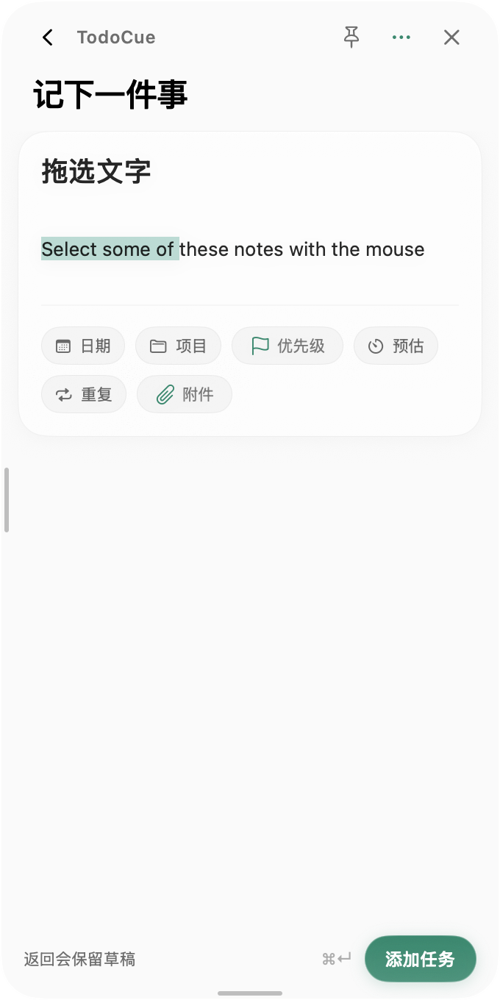

# v0.2.0 表单与面板交互修复

审查范围：`7a6400f`（最近一次 UI 重构）、新建/快速添加/编辑入口、草稿缓存、异步保存、附件导入，以及原生面板的鼠标事件分发。

## 发现与修复

| 问题 | 原因与来源 | 修复后的行为 |
| --- | --- | --- |
| 新建出现上一个任务的备注，甚至仍处于编辑模式 | 新建与编辑共用 `savedDraft`；新建快捷键遇到任意表单直接返回。这些逻辑早于 `7a6400f` | 创建草稿和按任务 ID 保存的编辑草稿隔离；从编辑界面新建会进入创建表单；输入了新标题的快速添加从干净草稿开始 |
| 切换任务时表单仍显示上一份内容 | 路由中的 `TaskFormView` 没有稳定的会话身份，SwiftUI 可沿用已有 `@State` | 使用已有的创建幂等键作为表单身份；同一草稿输入时身份不变，换草稿时重建状态 |
| 拖选备注变成拖动窗口 | 面板启用全窗口背景拖动，配置早于 UI 重构 | 关闭全窗口背景拖动；仅顶部空白区域显式发起窗口拖动；文本拖拽交给 AppKit 编辑器 |
| 清空草稿后旧内容又回来，查看后未修改的任务也会缓存旧版本 | 空草稿不会清理缓存；编辑草稿没有区分是否修改 | 清空后清理创建缓存；只有实际修改过的编辑草稿才保留；设置等页面覆盖表单后离开仍保留修改 |
| 保存发生版本冲突后重复失败 | 原逻辑刷新列表，但表单仍保留旧 `expectedVersion` | 保留当前输入并显示冲突；提供明确的“重新载入最新任务（替换当前草稿）”动作，从单任务 API 获取新内容和版本，完成后可正常保存 |
| 异步保存/附件结果写入另一份表单，保存后又恢复已经提交的草稿 | 表单更新只检查“顶层是否为表单”；保存完成时无条件清理共享缓存 | 更新按会话身份匹配；保存只清理对应的提交快照和路由；晚到的附件更新只作用于所属草稿 |
| 属性标签中的清除动作与打开选择器冲突 | `7a6400f` 把 Button 嵌入 Button/Menu 的标签 | 清除按钮与选择器成为独立的相邻控件 |
| 第一个附件导入失败时看不到错误，多文件拖入可能绕过数量/总大小检查 | 重构后错误放在仅有附件时出现的画廊里；每个拖入文件单独发起异步导入 | 错误独立显示；一次拖放作为一个批次顺序读取、整体校验后提交；导入期间禁用重复导入和保存；执行 20 个、单个 10 MB、总计 30 MB 限制 |
| 重复任务同时显示可编辑的普通日期，但保存忽略这些设置 | 重构后日期弹层与重复弹层同时可操作 | 重复任务使用重复弹层里的开始日期/时间/提醒；普通日期标签在重复模式隐藏，启用重复时沿用已有计划日期；恢复首次任务附件说明 |
| 新表单英文界面混入中文 | 新增文案没有完整加入翻译目录 | 补齐相关占位符、标签、错误与恢复动作的英文翻译 |

## 验证

- `npm run check`：TypeScript 构建、87 个 Vitest 测试、17 个发布脚本测试、CLI/MCP/附件/提醒/SSE/重启 smoke checks、版本与发布资料检查通过。
- `swift test --package-path apps/macos`：181 个测试，0 失败；2 个既有截图测试因未提供专用运行时 fixture 而按设计跳过。
- 新增 12 个回归测试：创建/编辑草稿隔离、连续创建、清空草稿、快速添加日期、不同会话的晚到更新、未修改编辑的刷新、覆盖表单的导航、保存完成后的缓存/路由、冲突与最新版本恢复、附件批量限制、真实输入框键盘输入与表单切换、真实备注鼠标拖选。
- 原生拖选测试把 mouseDown/drag/up 交给真实面板和 AppKit field editor，断言选中范围非空且窗口 frame 不变；检查头部空白区域实际命中专用拖动视图。
- `npm run macos:dmg`：release 模式原生构建、App 签名验证、内置 Node/SQLite/MCP 加载检查通过，生成本机 arm64 DMG。此为本地修复构建，版本号仍为 0.2.0，未发布新版本。

## 界面证据

截图由上述原生鼠标拖选测试通过 ScreenCaptureKit 捕获。数据为临时测试草稿，使用单独的白色窗口作为背景，不连接个人运行时。

测试隔离在内存模型、临时设置和 URLProtocol fixture 中；未操作用户的任务数据库。
